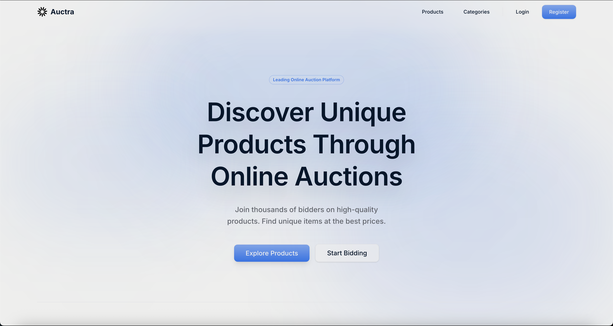
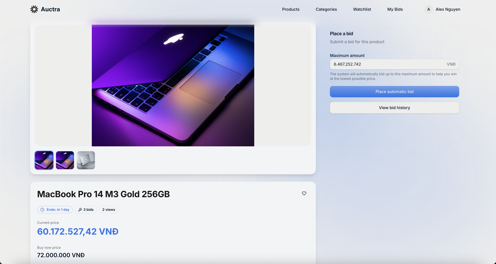
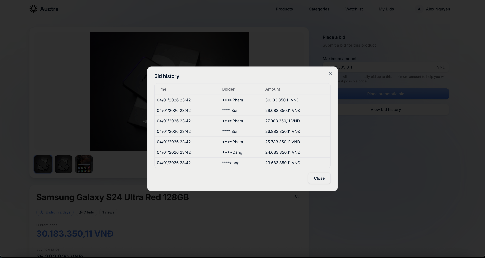
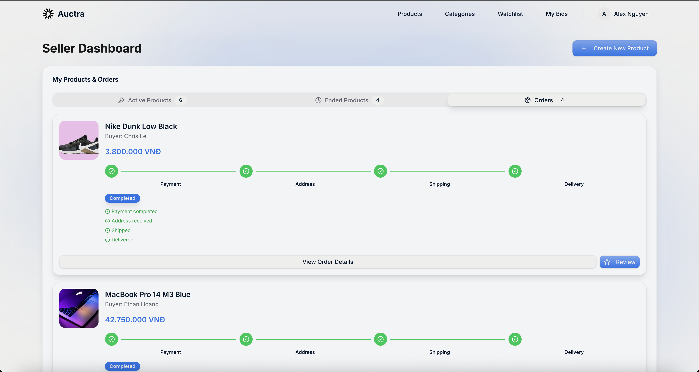
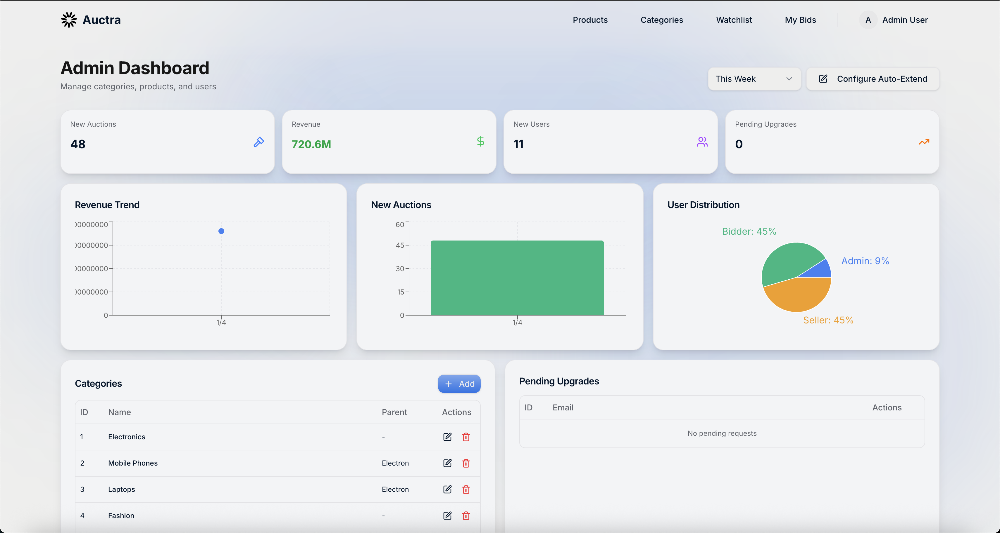

<!-- title: AUCTRA -->
<br />
<div align="center">
  <h1 align="center">Auctra</h1>
  <p align="center">
    A modern online auction platform designed for seamless user experience
  </p>
  <a href="https://csc13114-auctra.vercel.app/">Go to Auctra!</a>
</div>

## Overview

Auctra is a comprehensive, full-stack online auction platform featuring real-time bidding, automated notifications, secure payments, and role-based access control. Built with modern technologies and best practices, it provides a seamless experience for buyers and sellers.

## Description

Auctra solves the challenge of creating a reliable and engaging online auction environment. It supports multiple user roles including Guests, Bidders, Sellers, and Administrators. The platform leverages real-time technologies to ensure instant bid updates and chat functionality. With a focus on security and usability, Auctra implements robust authentication, payment processing via Stripe, and a responsive design suitable for all devices.

## Information & Contact

- Course: University of Science, VNU-HCM - CSC13114
- Project: Auctra - Online Auction Platform
- Team Members:

| No. | Student ID | Full Name           | Email                       |
| --- | ---------- | ------------------- | --------------------------- |
| 1   | 22127152   | Lê Gia Huy          | lghuy22@clc.fitus.edu.vn    |
| 2   | 22127203   | Võ Ngọc Khoa        | vnkhoa22@clc.fitus.edu.vn   |

## Screenshots


*Homepage: Featured auctions and navigation*


*Product Details: Comprehensive view with images, description, and bid history*


*Bidding Interface: Real-time bid placement modal*


*Seller Dashboard: Product management and sales tracking*


*Admin Dashboard: System metrics and user management*

## Features

### Core Features

1. **User Management & Roles**
   - **Guest Users**: Browse categories, search products, view details.
   - **Bidders**: Place bids, auto-bidding, watch lists, Q&A with sellers.
   - **Sellers**: Post auctions, manage products, reject bids, dashboard analytics.
   - **Administrators**: Manage categories, users, and platform settings.

2. **Product Discovery**
   - **Smart Search**: Full-text search with Vietnamese language support.
   - **Category Navigation**: 2-level hierarchy for organized browsing.
   - **Rich Details**: Comprehensive product info, images, and history.

3. **Bidding System**
   - **Live Bidding**: Real-time bid placement and updates.
   - **Auto-Bidding**: Set max bid for automated participation.
   - **Bid Extension**: Automatic time extension for last-minute bids.

### Advanced Features

1. **Real-Time Ecosystem**
   - **Notifications**: Instant alerts for bids, wins, and events via Socket.io and Email.
   - **Live Chat**: Direct messaging between buyers and sellers.
   - **Dynamic Updates**: Real-time dashboard and bid history updates.

2. **Security & Payments**
   - **Secure Payments**: 4-step order completion with Stripe integration.
   - **Authentication**: JWT-based access and refresh token system.
   - **Access Control**: Role-based permissions and verification.

### User Interface

- **Responsive Design**: Optimized for desktop, tablet, and mobile.
- **Modern UX**: Built with React and Tailwind CSS for a premium feel.
- **Internationalization**: Full Vietnamese language support.

### Quality Features

- **Performance**: Optimized load times and real-time responsiveness.
- **Reliability**: Comprehensive error handling and validation (Zod/Yup).
- **Scalability**: Docker containerization and cloud-ready architecture (Railway/Vercel).

## Tech Stack

### Frontend

![React][React] ![TypeScript][TypeScript] ![Vite][Vite] ![TailwindCSS][TailwindCSS]
![Redux][Zustand] ![Stripe][Stripe] ![Socket.io][Socket]

### Backend

![Node.js][Node.js] ![Express][Express] ![PostgreSQL][PostgreSQL] ![Sequelize][Sequelize]
![Docker][Docker] ![JWT][JWT] ![Nodemailer][Nodemailer]

### Development Tools

![Git][Git] ![ESLint][ESLint] ![Prettier][Prettier] ![GitHub Actions][Actions]

<!-- MARKDOWN LINKS & IMAGES -->

[React]: https://img.shields.io/badge/React-20232A?style=for-the-badge&logo=react&logoColor=61DAFB
[TypeScript]: https://img.shields.io/badge/TypeScript-007ACC?style=for-the-badge&logo=typescript&logoColor=white
[Vite]: https://img.shields.io/badge/Vite-646CFF?style=for-the-badge&logo=vite&logoColor=white
[TailwindCSS]: https://img.shields.io/badge/Tailwind_CSS-38B2AC?style=for-the-badge&logo=tailwind-css&logoColor=white
[Zustand]: https://img.shields.io/badge/Zustand-orange?style=for-the-badge&logo=redux&logoColor=white
[Stripe]: https://img.shields.io/badge/Stripe-635BFF?style=for-the-badge&logo=stripe&logoColor=white
[Socket]: https://img.shields.io/badge/Socket.io-010101?style=for-the-badge&logo=socket.io&logoColor=white
[Node.js]: https://img.shields.io/badge/Node.js-339933?style=for-the-badge&logo=nodedotjs&logoColor=white
[Express]: https://img.shields.io/badge/Express.js-404D59?style=for-the-badge
[PostgreSQL]: https://img.shields.io/badge/PostgreSQL-316192?style=for-the-badge&logo=postgresql&logoColor=white
[Sequelize]: https://img.shields.io/badge/Sequelize-52B0E7?style=for-the-badge&logo=sequelize&logoColor=white
[Docker]: https://img.shields.io/badge/Docker-2496ED?style=for-the-badge&logo=docker&logoColor=white
[JWT]: https://img.shields.io/badge/JWT-000000?style=for-the-badge&logo=json-web-tokens&logoColor=white
[Nodemailer]: https://img.shields.io/badge/Nodemailer-2496ED?style=for-the-badge&logo=gmail&logoColor=white
[Git]: https://img.shields.io/badge/Git-F05032?style=for-the-badge&logo=git&logoColor=white
[ESLint]: https://img.shields.io/badge/ESLint-4B32C3?style=for-the-badge&logo=eslint&logoColor=white
[Prettier]: https://img.shields.io/badge/Prettier-F7B93E?style=for-the-badge&logo=prettier&logoColor=black
[Actions]: https://img.shields.io/badge/GitHub_Actions-2088FF?style=for-the-badge&logo=github-actions&logoColor=white

## Building and Usage

### Prerequisites

- **Node.js** 18+ and npm
- **PostgreSQL** 15+ (or Supabase account)
- **Git**
- **Stripe Account** (for payments)
- **Gmail Account** (for email notifications)

### Installation

1. **Clone the repository**
   ```bash
   git clone https://github.com/legiahuy/csc13114-online-auction.git
   cd csc13114-online-auction
   ```

2. **Backend Setup**
   ```bash
   cd backend
   npm install
   cp env.example .env
   # Edit .env with your configuration
   npm run seed  # Seed database with sample data
   npm run dev   # Start development server
   ```

3. **Frontend Setup**
   ```bash
   cd frontend
   npm install
   cp .env.example .env
   # Edit .env with your configuration
   npm run dev   # Start development server
   ```

4. **Access the Application**
   - Frontend: http://localhost:5173
   - Backend API: http://localhost:3000
   - API Docs: http://localhost:3000/api-docs

### Environment Variables

#### Backend (.env)

```bash
# Server
PORT=3000
NODE_ENV=development

# Database (Supabase)
DATABASE_URL=postgresql://postgres:[PASSWORD]@[PROJECT].supabase.co:5432/postgres
DB_SSL=true

# JWT
JWT_SECRET=your-super-secret-jwt-key
JWT_REFRESH_SECRET=your-super-secret-refresh-key
JWT_ACCESS_EXPIRES_IN=15m
JWT_REFRESH_EXPIRES_IN=7d

# Email (Gmail)
EMAIL_HOST=smtp.gmail.com
EMAIL_PORT=587
EMAIL_USER=your-email@gmail.com
EMAIL_PASSWORD=your-app-password
EMAIL_FROM=noreply@auction.com

# Supabase Storage
SUPABASE_URL=https://your-project.supabase.co
SUPABASE_ANON_KEY=your-anon-key
SUPABASE_STORAGE_BUCKET=product-images

# Frontend
FRONTEND_URL=http://localhost:5173

# reCAPTCHA & Stripe
RECAPTCHA_SECRET_KEY=your-secret-key
STRIPE_SECRET_KEY=your-stripe-secret-key
```

#### Frontend (.env)

```bash
VITE_API_URL=http://localhost:3000
VITE_RECAPTCHA_SITE_KEY=your-site-key
VITE_STRIPE_PUBLISHABLE_KEY=your-stripe-publishable-key
```

### Docker Deployment

Run the entire stack with Docker Compose:

```bash
# Build and start all services
docker-compose up --build

# Stop services
docker-compose down
```

## Project Structure

```
csc13114-auctra/
├── backend/                # Express.js API
│   ├── src/               # TypeScript source code
│   │   ├── controllers/   # Route controllers
│   │   ├── models/        # Sequelize models
│   │   ├── routes/        # API routes
│   │   └── services/      # Business logic
│   ├── tests/             # Jest tests
│   └── package.json       # Backend dependencies
├── frontend/               # React Application
│   ├── src/               # TypeScript source code
│   │   ├── components/    # Reusable UI components
│   │   ├── pages/         # Page components
│   │   ├── stores/        # Zustand state management
│   │   └── types/         # TypeScript definitions
│   └── package.json       # Frontend dependencies
├── docker-compose.yml      # Docker orchestration
└── README.md              # Project documentation
```
